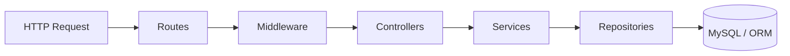

# System Architecture - Flight Booking System

This document outlines the high-level architecture, directory responsibilities, design patterns, and boundaries of the **Flight Booking System** (Root Project).

---

## 1. High-Level System Overview
The Flight Booking System is designed as a modular, scalable service aimed at handling flight scheduling, search, seat configurations, and booking management. The root project currently serves as the **Flight & Inventory Master Service**, managing the static catalog (Airplanes, Airports, Cities) and dynamic schedules (Flights, Seats). 

The system is built to transition into a decentralized **Microservices Architecture**, where the Flight Service operates independently of a Booking Service, communicating via RESTful APIs and transaction patterns to ensure seat inventory integrity.

```mermaid
graph TD
    subgraph Client Layer
        UI[Web/Mobile Client]
        Gateway[API Gateway / Reverse Proxy]
    end

    subgraph Service Layer (Future State)
        FlightService[Active Root Flight Service]
        BookingService[Booking Service - Planned]
        AuthService[Auth Service - Planned]
    end

    subgraph Database Layer
        FlightDB[(MySQL - Flights DB)]
        BookingDB[(MySQL - Booking DB)]
        Redis[(Redis - Temporary Bookings)]
    end

    UI --> Gateway
    Gateway --> FlightService
    Gateway --> BookingService
    Gateway --> AuthService
    
    FlightService --> FlightDB
    BookingService --> BookingDB
    BookingService --> Redis
    BookingService -- HTTP / REST --> FlightService
```

---

## 2. Layered Architecture (Clean Architecture)
The application strictly enforces a **Separation of Concerns** using a layered flow. No layer bypasses its immediate successor (e.g., Controllers never query the Database directly; they must call Services).



### Flow of Execution:
1. **Routes**: Entry point for HTTP requests. Registers URL endpoints and maps them to their respective controllers and middlewares.
2. **Middleware**: Intercepts requests to validate parameters, request bodies, and check headers before they reach business logic.
3. **Controllers**: Extracts raw request parameters, forwards them as structured payloads to the services layer, and structures responses using uniform success/error formats.
4. **Services**: Houses the core business logic. Performs calculations, processes complex constraints (e.g., arrival time validations), and invokes repository methods.
5. **Repositories**: Encapsulates database queries. Inherits generic operations from a base CRUD repository class, while allowing custom specialized methods (e.g., custom flight filters).
6. **Database (Sequelize ORM)**: Integrates object-oriented Javascript models with the underlying MySQL database tables.

---

## 3. Folder Responsibilities

| Directory | Responsibility |
| :--- | :--- |
| `src/config/` | Contains configuration modules (Winston Logger, dotenv settings, server ports). |
| `src/routes/` | Defines HTTP endpoints divided by API version (e.g., `v1/`). |
| `src/middlewares/` | Validates payload structures (e.g., verifying `flightNumber` is provided). |
| `src/controllers/` | Acts as the interface between HTTP and internal services; sets status codes and maps response envelopes. |
| `src/services/` | Contains core transactional rules and business logic. |
| `src/repositories/` | Houses data-access objects, encapsulating SQL queries and Sequelize actions. |
| `src/models/` | Declares database tables and associations via Sequelize. |
| `src/migrations/` | Manages historical changes to the database schemas. |
| `src/seeders/` | Seeds development databases with initial master data (airplanes, seats). |
| `src/utils/` | Houses error classes (`app-errors.js`), common models, helper scripts, and enums. |

---

## 4. Technology Stack
* **Runtime**: Node.js (v18+)
* **Framework**: Express (v5.2.1-ready)
* **Database**: MySQL (v8.0+)
* **ORM**: Sequelize (v6.37.8) with Sequelize-CLI for database migrations
* **Logger**: Winston (v3.19.0)
* **Utilities**: dotenv (config management), http-status-codes (standardizing API responses)

---

## 5. Service Boundaries & Future Microservices Path

Currently, all code lives in a single monolithic structure (the root directory), but the boundary limits have been set to enable easy extraction of services:

1. **Flight Service (Inventory Domain)**:
   * **Scope**: Airplanes, Airports, Cities, Flights, and Physical Seats.
   * **Role**: Catalog of records and source of truth for seat capacity.
   * **Database**: Holds the `Airplanes`, `Cities`, `Airports`, `Flights`, and `FlightSeats` tables.
2. **Booking Service (Order Domain - Planned)**:
   * **Scope**: Booking records, passenger lists, ticket issues, payment records, and temporary seat holds.
   * **Role**: Processes reservations, talks to external payment gateways, coordinates Saga transactions.
   * **Database**: Isolated from Flight DB. Holds `Bookings`, `Passengers`, and `Tickets` tables.
3. **Authentication Service (User Domain - Planned)**:
   * **Scope**: User profiles, credentials, hashing, JWT token verification, role permissions (e.g., Admin vs Customer).
   * **Role**: Signs and validates tokens, protects endpoints on the API Gateway level.
