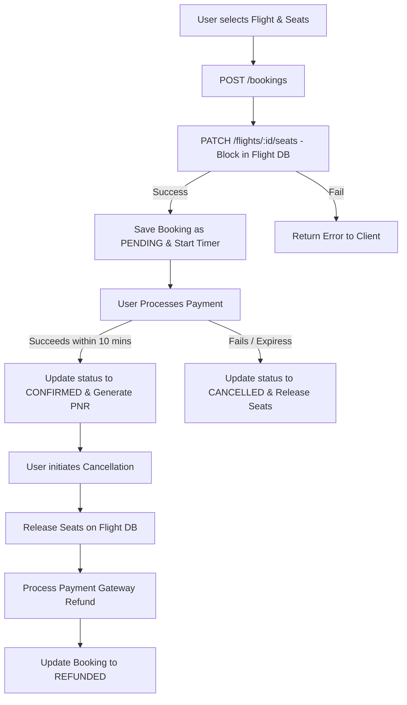

# Booking Lifecycle - Flight Booking System

This document outlines the detailed lifecycle of a booking from creation to confirmation or cancellation, including payments, timeouts, and saga transaction mechanics.

---

## 1. Step-by-Step Lifecycle Flows

### A. Booking Creation & Seat Block (PENDING)
1. The client sends a `POST /bookings` request with flight ID, user ID, passenger details, and selected seat IDs.
2. The Booking Service records the booking in its local database with a state of `PENDING` and calculates the total ticket price.
3. The Booking Service calls the Flight Service API `PATCH /flight/:id/seats` with `dec: true` to block the selected seats.
4. If seat blocking succeeds, the Booking Service sets up a 10-minute expiry key in Redis.
5. A `201 Created` response containing the payment link is returned to the user.

### B. Payment & Confirmation (CONFIRMED)
1. The user completes payment via the checkout URL.
2. The payment gateway triggers a callback webhook `POST /bookings/payments` with checkout details.
3. The Booking Service verifies the webhook payload.
4. If payment was successful, the Booking Service updates the booking state to `CONFIRMED`.
5. Unique Passenger Name Record (PNR) codes are generated for each passenger.
6. The client receives a booking confirmation and the tickets.

### C. Booking Expiration (Timeout)
1. If the user does not pay within 10 minutes, the Redis expiration event fires, or a background worker finds the stale pending booking.
2. The Booking Service updates the booking record state to `CANCELLED`.
3. The Booking Service executes a compensating call to the Flight Service (`PATCH /flight/:id/seats` with `dec: false`) to release the seat count and unbind the seats.

### D. Cancellation & Refunds (REFUNDED)
1. A user requests a cancellation for a `CONFIRMED` booking.
2. The Booking Service sets the state to `CANCELLATION_PENDING`.
3. The Booking Service sends a release request to the Flight Service to free up the seats immediately.
4. The Booking Service calls the payment gateway's refund API.
5. Upon confirmation from the payment gateway, the Booking Service updates the booking status to `REFUNDED`.

---

## 2. Distributed Transactions: The Saga Pattern

Since the system is split across two microservice domains (Booking DB and Flight DB), standard ACID transactions are not available. Instead, the system uses an **Orchestrator-based Saga Pattern** to ensure eventual consistency.

| Step | Service | Action | Compensation (Rollback) Action |
| :--- | :--- | :--- | :--- |
| 1 | Booking | Create `PENDING` booking | Mark booking as `CANCELLED` |
| 2 | Flight | Reserve seats & decrement inventory | Call API to release seats & increment inventory |
| 3 | Booking | Process gateway payment charge | Issue full refund to card |

### Compensating Transactions in Action:
If **Step 3 (Payment)** fails (e.g. card declined or timeout expired), the orchestrator initiates compensation:
1. It updates the booking database row status to `CANCELLED`.
2. It sends an API request to the Flight Service to increment the flight's available seat count and remove the `bookingId` from the corresponding `FlightSeats` entries.
This compensates for the action taken in **Step 2** and restores the database clusters to a consistent state.
