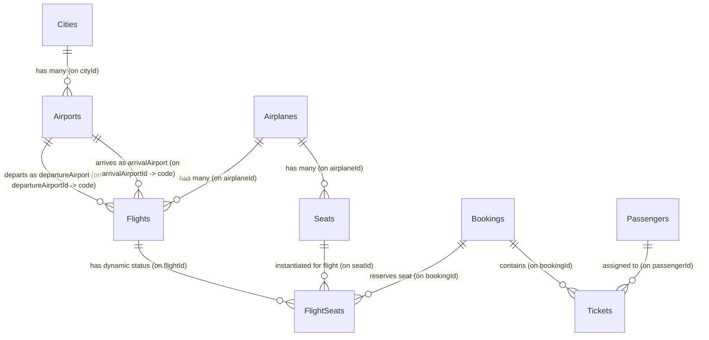

# Database Design & Schema Reference - Flight Booking System

This document outlines the database schema, entity relationships, columns, constraints, indexes, and purposes of the tables in the system.

---

## 1. Entity Relationship (ER) Diagram

---

## 2. Table Schemas

### A. `Cities` Table
* **Purpose**: Master table for cities where flights originate or arrive.
* **Columns**:
  * `id` (INT, PK, Auto Increment, Non-Null)
  * `name` (VARCHAR(255), Unique, Non-Null): Name of the city (e.g., "Mumbai", "Delhi").
  * `createdAt` (DATETIME, Non-Null)
  * `updatedAt` (DATETIME, Non-Null)
* **Indexes**:
  * `PRIMARY` on `id`
  * `name` (Unique Index)

### B. `Airports` Table
* **Purpose**: Master table representing individual airports located within cities.
* **Columns**:
  * `id` (INT, PK, Auto Increment, Non-Null)
  * `name` (VARCHAR(255), Unique, Non-Null): Name of the airport (e.g., "Chhatrapati Shivaji Maharaj International Airport").
  * `code` (VARCHAR(255), Unique, Non-Null): 3-letter IATA code (e.g., "BOM", "DEL").
  * `address` (VARCHAR(255), Nullable)
  * `cityId` (INT, FK -> `Cities.id`, Non-Null): City where the airport is located.
  * `createdAt` (DATETIME, Non-Null)
  * `updatedAt` (DATETIME, Non-Null)
* **Foreign Keys**:
  * `city_fkey_constraint`: `cityId` references `Cities.id` (ON DELETE CASCADE)
* **Indexes**:
  * `PRIMARY` on `id`
  * `code` (Unique Index)
  * `name` (Unique Index)
  * `cityId` (FK Index)

### C. `Airplanes` Table
* **Purpose**: Represents physical airplanes and their seat capacities.
* **Columns**:
  * `id` (INT, PK, Auto Increment, Non-Null)
  * `modelNumber` (VARCHAR(255), Non-Null): Alphanumeric model (e.g., "Airbus A320").
  * `capacity` (INT, Non-Null, Default: 0, Max Validation: 1000): Number of seats the airplane can accommodate.
  * `createdAt` (DATETIME, Non-Null)
  * `updatedAt` (DATETIME, Non-Null)
* **Indexes**:
  * `PRIMARY` on `id`

### D. `Seats` Table
* **Purpose**: Stores the physical layouts (seats) belonging to airplanes.
* **Columns**:
  * `id` (INT, PK, Auto Increment, Non-Null)
  * `airplaneId` (INT, FK -> `Airplanes.id`, Non-Null)
  * `row` (INT, Non-Null): Horizontal seat row (e.g., 1, 2, 3).
  * `col` (VARCHAR(255), Non-Null): Vertical column letter (e.g., "A", "B", "C").
  * `type` (ENUM('business', 'economy', 'premium-economy', 'first-class'), Default: 'economy', Non-Null)
  * `createdAt` (DATETIME, Non-Null)
  * `updatedAt` (DATETIME, Non-Null)
* **Foreign Keys**:
  * `Seats_ibfk_1`: `airplaneId` references `Airplanes.id` (ON DELETE CASCADE)
* **Indexes**:
  * `PRIMARY` on `id`
  * `airplaneId` (FK Index)
  * **Recommended Index**: Unique composite index on `(airplaneId, row, col)` to prevent duplicate physical seat layout coordinates.

### E. `Flights` Table
* **Purpose**: Details scheduling, pricing, and availability for a specific flight route instance.
* **Columns**:
  * `id` (INT, PK, Auto Increment, Non-Null)
  * `flightNumber` (VARCHAR(255), Non-Null): Identifier (e.g., "AI 801").
  * `airplaneId` (INT, FK -> `Airplanes.id`, Non-Null)
  * `departureAirportId` (VARCHAR(255), FK -> `Airports.code`, Non-Null): Note: In active root models, this is currently defined as `INTEGER` (bug), but should be updated to `VARCHAR(255)` to align with the schema migration.
  * `arrivalAirportId` (VARCHAR(255), FK -> `Airports.code`, Non-Null): Note: In active root models, this is currently defined as `INTEGER` (bug), but should be updated to `VARCHAR(255)` to align with the schema migration.
  * `arrivalTime` (DATETIME, Non-Null)
  * `departurTime` (DATETIME, Non-Null): Spelling as per root migration.
  * `price` (INT, Non-Null): Cost of the flight ticket.
  * `bordingGate` (VARCHAR(255), Nullable): Spelling as per root migration.
  * `totalSeats` (INT, Non-Null): Represents total remaining seats.
  * `createdAt` (DATETIME, Non-Null)
  * `updatedAt` (DATETIME, Non-Null)
* **Foreign Keys**:
  * `Flights_airplaneId_fk`: `airplaneId` references `Airplanes.id` (ON DELETE CASCADE)
  * `Flights_departureAirportId_fk`: `departureAirportId` references `Airports.code` (ON DELETE CASCADE)
  * `Flights_arrivalAirportId_fk`: `arrivalAirportId` references `Airports.code` (ON DELETE CASCADE)
* **Indexes**:
  * `PRIMARY` on `id`
  * `airplaneId` (FK Index)
  * `departureAirportId` (FK Index)
  * `arrivalAirportId` (FK Index)
  * **Recommended Index**: Composite Index on `(departureAirportId, arrivalAirportId, departurTime)` to optimize query searches.

### F. `FlightSeats` Table (Recommended for Active Project)
* **Purpose**: Tracks dynamic seat availability for specific flight instances.
* **Columns**:
  * `id` (INT, PK, Auto Increment, Non-Null)
  * `flightId` (INT, FK -> `Flights.id`, Non-Null)
  * `seatId` (INT, FK -> `Seats.id`, Non-Null)
  * `bookingId` (INT, Nullable): Temporary hold/order lock identifier.
  * `createdAt` (DATETIME, Non-Null)
  * `updatedAt` (DATETIME, Non-Null)
* **Foreign Keys**:
  * `FlightSeats_flightId_fk`: `flightId` references `Flights.id` (ON DELETE CASCADE)
  * `FlightSeats_seatId_fk`: `seatId` references `Seats.id` (ON DELETE CASCADE)
* **Indexes**:
  * `PRIMARY` on `id`
  * `flightId` (FK Index)
  * `seatId` (FK Index)
  * `bookingId` (FK Index)
  * `flightId_seatId_unique`: Composite Unique Index on `(flightId, seatId)` to prevent duplicate allocations.
