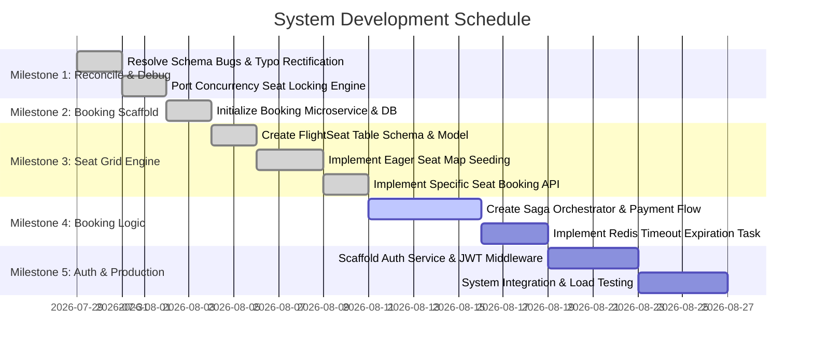

# Development Roadmap - Flight Booking System

This roadmap details the current implementation status and outlines subsequent milestones for building, refining, and preparing the Flight Booking System for production.

---

## 1. Current Progress Registry

### Completed
* **Boilerplate Framework**: Initialized Express system with layered architectural directories (Controllers, Services, Repositories, Middlewares, Models, Config).
* **Airplane Service**: Full API CRUD operations, Sequelize model definitions, and database migrations.
* **City Service**: Standard API CRUD operations, Sequelize model definitions, validations, and database migrations.
* **Airport Service**: Standard API CRUD operations, Sequelize model definitions, unique code mappings, validations, and database migrations.
* **Flight Search Engine**: API endpoints to retrieve and filter scheduled flights based on parameters (pricing ranges, destination city pairs, dates) with associated airline detail inclusions.
* **Seat Table Schema**: Database schema models, seeders, and migrations for `Seats` containing rows, columns, and tier categorizations (`business`, `economy`, `first-class`).
* **Flight Service Stabilization & Debugging**: Fixed the Flight-Airport datatype mismatch, controller typos (`res.jsoon`), spelling inconsistencies (`updtateFlight`, `updtaeAirplane`), and middleware validation bugs.
* **Concurrency Seat Locking Engine**: Ported row-level transaction locking (`SELECT FOR UPDATE`) and the `PATCH /flight/:id/seats` API to the active root project.
* **Booking Service Scaffolding**: Initialized `/Booking-Service` microservice, creating its `package.json`, environment configs, database tables migrations (Bookings, Passengers, Tickets), Sequelize models, repositories, controllers, services, and route layers.

### In Progress
* **Auth Service Microservice**: Designing and initializing authorization scopes, JWT middlewares, RBAC roles.

### Remaining
* **Auth Service Microservice**: Authenticated routes, roles management (customer vs. airline desk clerk), JWT generation.
* **Production Prep**: E2E integration and load testing boundaries.

---

## 2. Future Milestones Plan

### Milestone 1: Reconcile & Debug (Completed)
* **Goal**: Rectify all existing model/migration discrepancies, syntax typos, and port the transaction locking engine.
* **Tasks Completed**:
  1. Fixed `departureAirportId` and `arrivalAirportId` datatypes in `src/models/flight.js` from `INTEGER` to `STRING`.
  2. Fixed controller typos (`res.jsoon` $\rightarrow$ `res.json`, functions `updtateFlight`, `updtaeAirplane`, middleware `ErrorResponce`).
  3. Implemented `updateRemainingSeats` with pessimistic row locking (`SELECT FOR UPDATE`) and exposed `PATCH /api/v1/flight/:id/seats`.

### Milestone 2: Booking Service Scaffolding (Completed)
* **Goal**: Scaffold the dedicated Booking Service microservice directory structure, models, migrations, routes, and controllers.
* **Tasks Completed**:
  1. Created `/Booking-Service` parallel directory structure.
  2. Defined DB migrations and Sequelize models for `Bookings`, `Passengers`, and `Tickets`.
  3. Configured environment ports (3001) and Winston logger frameworks.
  4. Scaffolding controllers, services, repositories, and routes for standard resource registration.

### Milestone 3: Flight Seat Grid Engine (Completed)
* **Goal**: Build dynamic seat mapping and specific seat reservation interfaces in Flight Service.
* **Tasks Completed**:
  1. Created the `FlightSeat` model and migration with unique `(flightId, seatId)` constraint and status indexes.
  2. Implemented eager bulk-seeding of `FlightSeat` records on flight creation in the same transaction.
  3. Added `GET /api/v1/flight/:id/seats` API to fetch structured seat configs without leaking internal database properties.
  4. Upgraded `PATCH /api/v1/flight/:id/seats` to support RESERVE and RELEASE actions protected by pessimistic locks (`SELECT FOR UPDATE`).

### Milestone 4: Booking Service Business Logic (Est. Duration: 8 Days)
* **Goal**: Implement reservation rules, payment callbacks, and TTL key cancellations.
* **Tasks**:
  1. Write the Saga Orchestrator: handle `POST /bookings` (reserve seat counts, save order state as `PENDING`, invoke Payment gateway checkout).
  2. Implement **Redis Expiration Worker**: publish key exhalations to automatically release locked seats on the Flight Service if payment is not confirmed within 10 minutes.
  3. Write payment webhook callback handler.

### Milestone 5: Auth Service & Production Prep (Est. Duration: 8 Days)
* **Goal**: Wrap endpoints in authentication boundaries and run verification checks.
* **Tasks**:
  1. Scaffold Auth Service (`User`, `Role`, `UserRoles` schemas).
  2. Write authentication and authorization middlewares (checking JWT tokens and role privileges, e.g. preventing standard users from deleting airports).
  3. Conduct end-to-end integration tests, load test the concurrency safe locking mechanism, and containerize the stack (Docker / Docker Compose).
