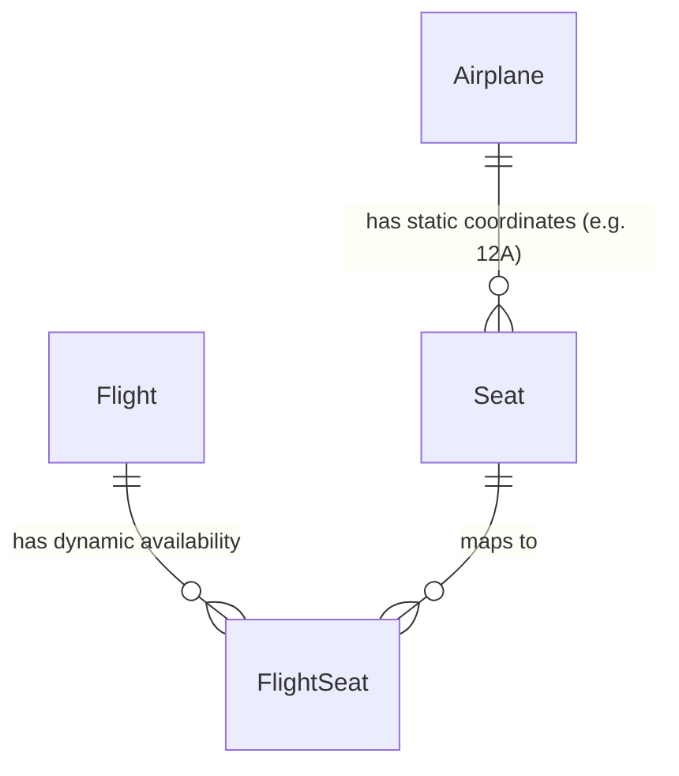
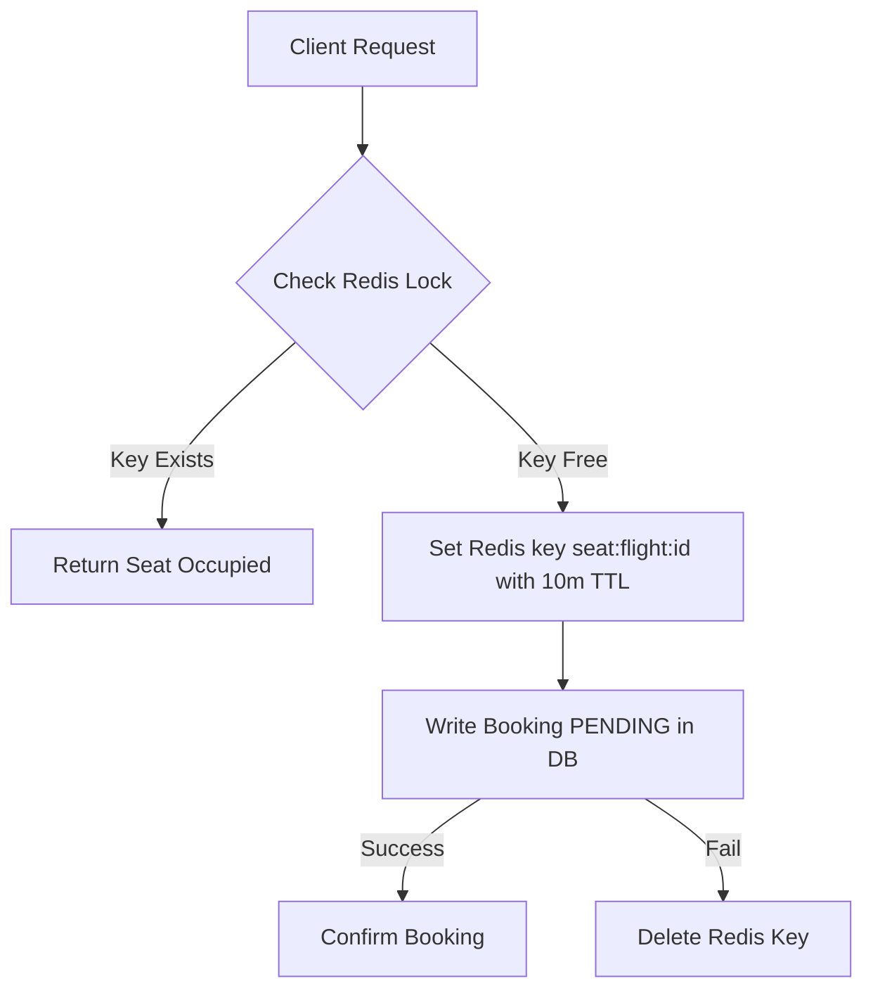

# Seat Management & Concurrency Design - Flight Booking System

This document outlines the design of the seat allocation system, explaining the mapping of physical seat configurations to flights and details the database lock mechanics used to prevent double bookings.

---

## 1. Static Layout vs. Dynamic Availability

To allow airplanes to fly multiple routes without booking conflicts, the database separates seat layout configuration from flight schedules.

* **Physical Layout (`Seats` Table)**: Stores static coordinates (e.g. Row 12, Column A) and classes (e.g. Business) associated with an `Airplane`. These records are read-only during scheduling.
* **Flight Instance Availability (`FlightSeats` Table)**: Serves as a dynamic junction table linking physical seats to individual flights. Every seat has a `bookingId` field. If `bookingId` is `NULL`, the seat is available for that specific flight.



---

## 2. Eager Allocation on Flight Creation

To ensure high performance and simple query states, the system utilizes an **eager allocation** strategy:
1. When a new flight is scheduled (`POST /api/v1/flights`), the service retrieves the associated `airplaneId`.
2. It fetches all physical `Seats` for that airplane.
3. In a single transaction, the system bulk-inserts rows mapping the `flightId` to every `seatId`, initialized with `bookingId = NULL`.

```javascript
// Conceptual logic during Flight creation:
const seats = await Seat.findAll({ where: { airplaneId } });
const flightSeatsPayload = seats.map(seat => ({
    flightId,
    seatId: seat.id,
    bookingId: null
}));
await FlightSeat.bulkCreate(flightSeatsPayload, { transaction });
```

---

## 3. Concurrency Control: Double Booking Prevention

When multiple concurrent users attempt to book the last remaining seats at the exact same millisecond, the system guarantees thread safety using **Pessimistic Locking (Row-Level Locking)**.

### Lock Protocol:
1. The Booking Service opens a transaction.
2. It requests seat reservation on the Flight Service.
3. The Flight Service queries the selected `FlightSeats` rows using SQL `FOR UPDATE`:
   ```sql
   SELECT * FROM FlightSeats 
   WHERE flightId = :flightId AND seatId IN (:seatIds) 
   FOR UPDATE;
   ```
4. **Lock Behavior**:
   * This query blocks any other database connections from reading (with locks) or writing to these specific rows until the active transaction commits or rolls back.
   * If Transaction A holds the lock, Transaction B's execution halts at this query.
5. **Validation**: The service verifies if any locked seat row has a non-null `bookingId`.
   * *If occupied*: Transaction rolls back immediately, returning an error.
   * *If available*: The service updates the rows with the `bookingId`, decrements the overall `totalSeats` count on the flight, and commits.
6. Once Transaction A commits, Transaction B acquires the lock, reads the updated row, detects that `bookingId` is occupied, and returns a "seat occupied" error to the user.

---

## 4. Alternate Strategy: Redis Reservation Locks (Distributed Locks)

For ultra-high-throughput systems where database row-locking could create bottlenecks, a **Redis-based Distributed Lock** strategy can be adopted:



### Flow details:
1. When selecting seats `12A` and `12B` on flight `4`, the system sets keys `lock:flight:4:seat:12A` and `lock:flight:4:seat:12B` in Redis using `SETNX` (set if not exists) with a 10-minute expiry.
2. If `SETNX` returns `0` for any key, it means another client is currently paying for that seat. The request fails immediately without querying the database.
3. If successful, the database writes occur asynchronously.
4. If payment completes, the database rows are updated permanently, and the Redis locks are cleared. If payment fails, the locks expire or are deleted, making the seats available instantly.
5. This shields the relational database from excessive read/write lock contention.
