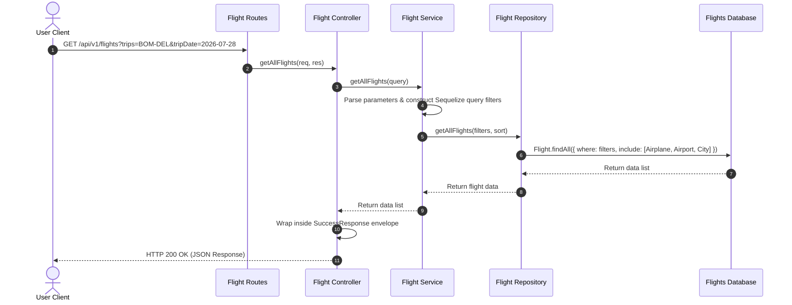
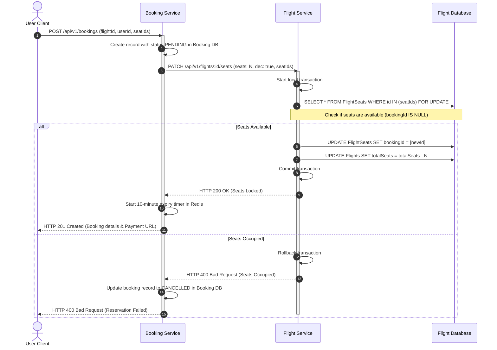
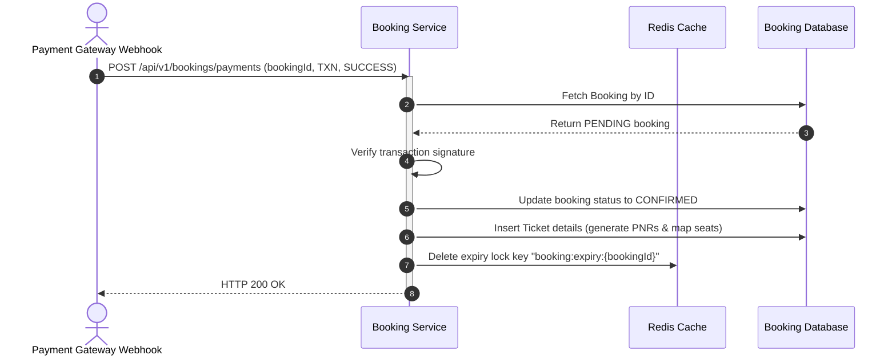
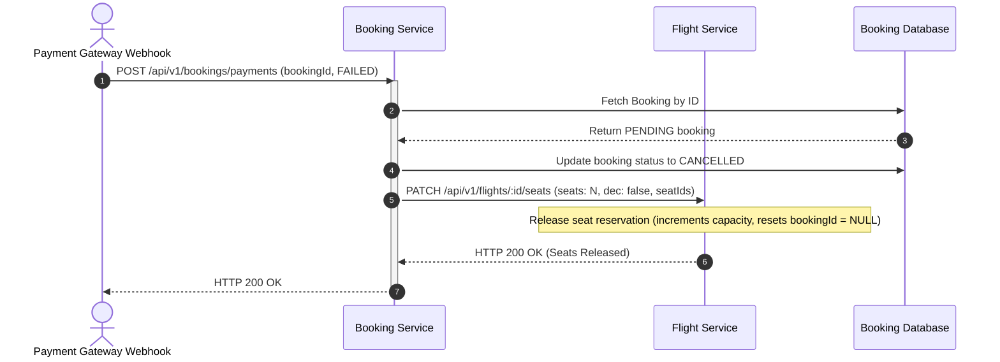
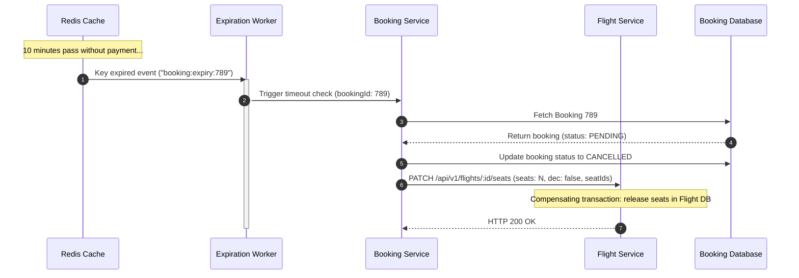
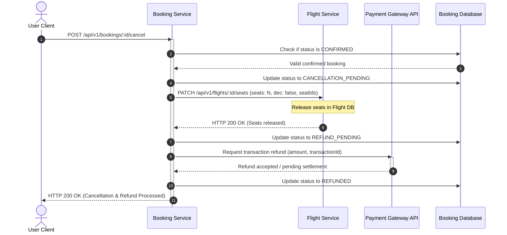

# Sequence Diagrams - Flight Booking System

This document visualizes the sequence of interactions across services and components for core business workflows.

---

## 1. Flight Search Flow

---

## 2. Booking Creation & Seat Reservation

---

## 3. Payment Success Flow

---

## 4. Payment Failure Flow

---

## 5. Booking Expiration (Timeout)

---

## 6. Booking Cancellation & Refund Flow

