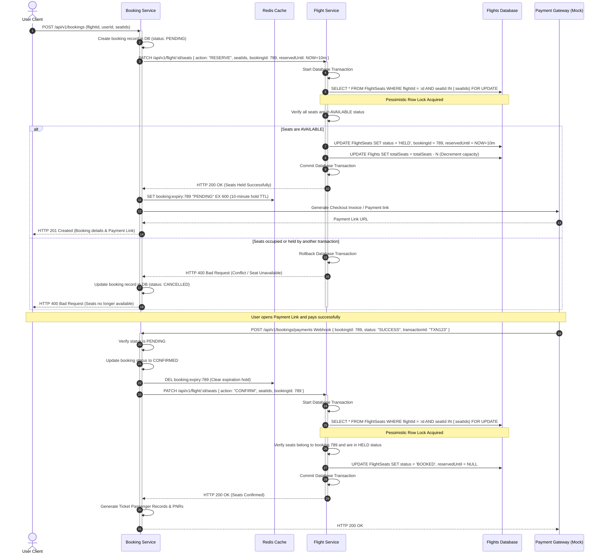
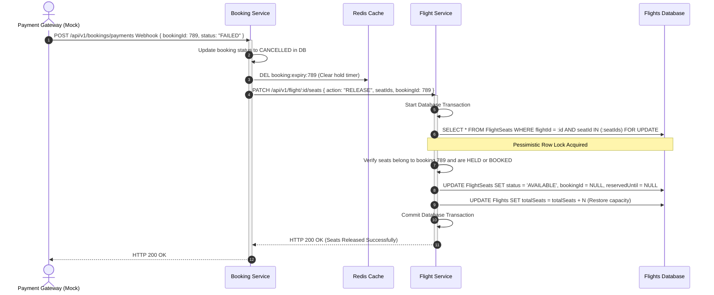
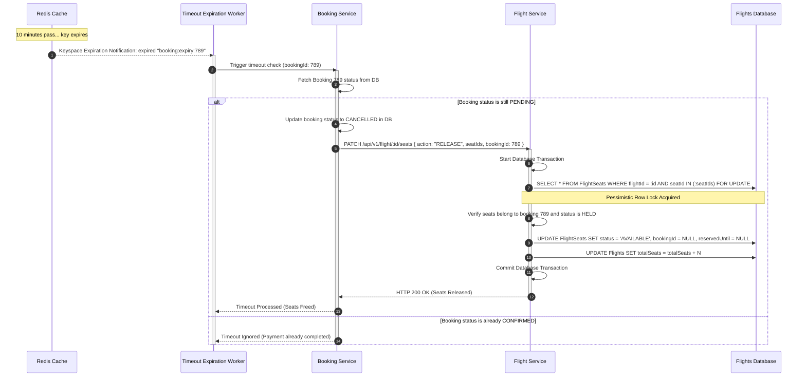
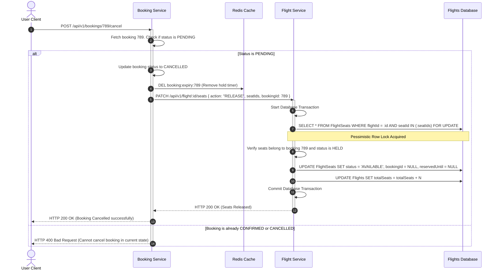
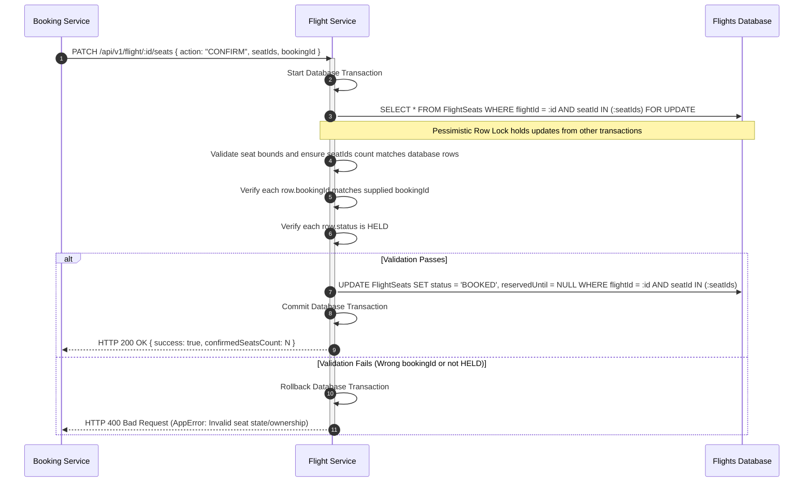
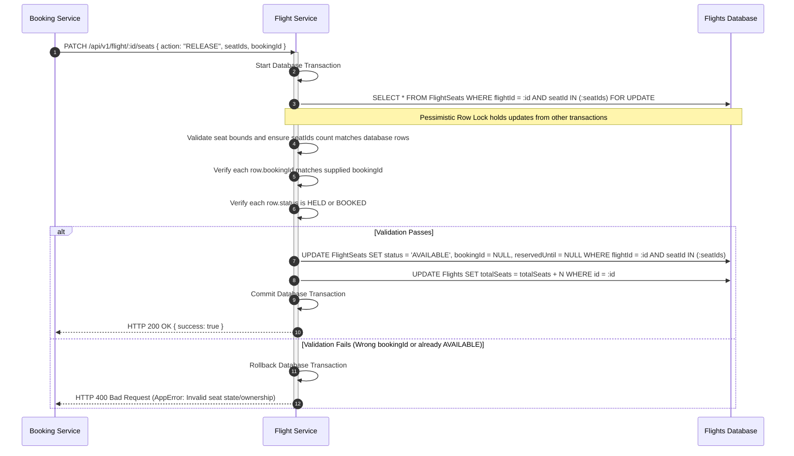

# Sequence Diagrams - Flight Booking System

This document visualizes the sequence of interactions across services and components for core business workflows.

---

## 1. Successful Booking (Hold & Payment Success)

---

## 2. Payment Failure Flow

---

## 3. Booking Expiration (Timeout) Flow

---

## 4. User Cancellation Before Payment

---

## 5. Seat Confirmation (Flight Service Internals)

---

## 6. Seat Release (Flight Service Internals)

