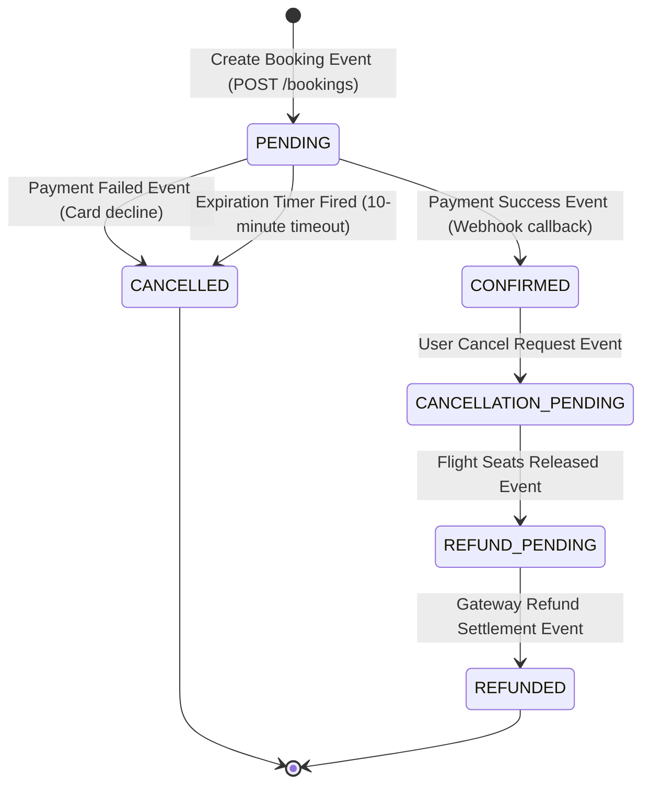

# Booking State Machine - Flight Booking System

This document describes the state machine governing a booking order, outlining every valid transition, trigger events, and execution paths.

---

## 1. State Transition Diagram

---

## 2. Transition Registry

| Current State | Target State | Triggering Event | Action Taken |
| :--- | :--- | :--- | :--- |
| `None` | `PENDING` | User initiates booking request. | Inserts booking with status `PENDING`, queries and locks seat inventory in the Flight Service, starts 10-minute timer. |
| `PENDING` | `CONFIRMED` | Gateway webhook sends successful charge. | Updates status to `CONFIRMED`, assigns PNR tickets to the passenger. |
| `PENDING` | `CANCELLED` | Gateway webhook sends declined card OR 10-minute timeout expires. | Updates status to `CANCELLED`, executes compensating API to release blocked seats. |
| `CONFIRMED` | `CANCELLATION_PENDING` | User requests booking cancellation. | Updates status to `CANCELLATION_PENDING`, initiates cancellation workflows. |
| `CANCELLATION_PENDING` | `REFUND_PENDING` | Flight Service confirms seat counts are released. | Releases `bookingId` from `FlightSeats` rows, increments available seat count, initiates gateway refund request. |
| `REFUND_PENDING` | `REFUNDED` | Payment gateway confirms money transfer completion. | Updates status to `REFUNDED`, flags ticket vouchers as invalid. |

---

## 3. Operational Paths

### A. Success Path (Standard Flow)
1. **Creation**: `None` $\rightarrow$ `PENDING` (Seats locked, timer running).
2. **Payment**: A webhook notification confirms payment status is successful.
3. **Transition**: `PENDING` $\rightarrow$ `CONFIRMED`.
4. **Completion**: Tickets generated.

### B. Timeout Path (Stale Hold Cleanup)
1. **Creation**: `None` $\rightarrow$ `PENDING`.
2. **No Activity**: 10 minutes pass without checkout completion.
3. **Trigger**: Redis TTL key expiry event fires.
4. **Transition**: `PENDING` $\rightarrow$ `CANCELLED`.
5. **Cleanup**: Compensating API updates the Flight Service to free seats.

### C. Failure Path (Card Declined)
1. **Creation**: `None` $\rightarrow$ `PENDING`.
2. **Checkout**: Payment gateway returns error code (e.g., insufficient funds).
3. **Transition**: `PENDING` $\rightarrow$ `CANCELLED`.
4. **Cleanup**: Compensating API releases blocked seat inventory.

### D. Refund Path (Post-Confirmation Cancellation)
1. **Active State**: Booking is `CONFIRMED`.
2. **Trigger**: User requests refund.
3. **Transition 1**: `CONFIRMED` $\rightarrow$ `CANCELLATION_PENDING`.
4. **Release**: Flight Service is notified to release seats immediately.
5. **Transition 2**: `CANCELLATION_PENDING` $\rightarrow$ `REFUND_PENDING` (Gateway contacted).
6. **Transition 3**: `REFUND_PENDING` $\rightarrow$ `REFUNDED` (Settlement confirmed).
